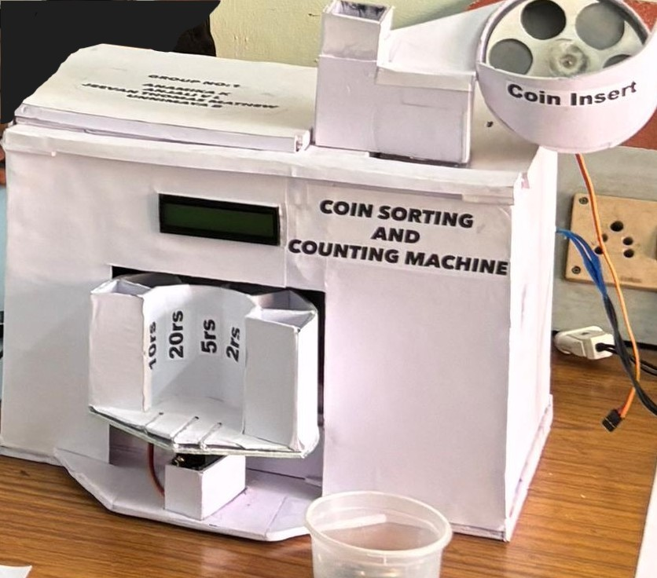
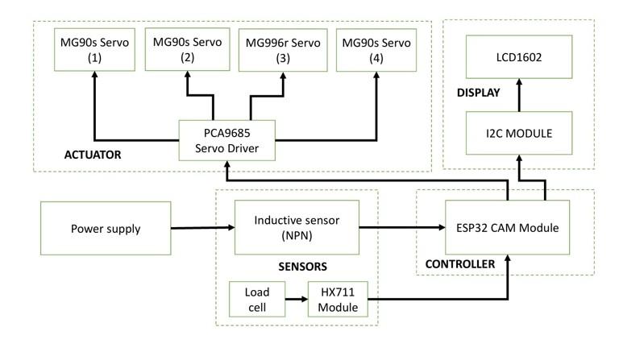

# Coin Sorting and Counting Machine

A weight-based automated Indian coin sorting and counting machine developed using ESP32. The system identifies coins based on their measured weight, automatically sorts them into designated sections, and keeps track of the number of coins processed.

## Project Overview

Manual coin sorting and counting can be time-consuming and prone to human error. This project aims to automate the process using a load cell, HX711 amplifier, sensors, servo motors, and an ESP32 microcontroller.

The system detects the presence of a coin, measures its weight, identifies the corresponding coin denomination, and controls the sorting mechanism to direct the coin to the appropriate collection section. The counting information is displayed on a 16x2 I2C LCD

## System Architecture

The overall architecture of the coin sorting and counting machine is shown below.

## Objectives

- Automate the sorting of Indian coins.
- Identify coins using weight measurement.
- Automatically count the sorted coins.
- Reduce manual effort and counting errors.
- Display the coin count and relevant information on an LCD.
- Develop a compact and low-cost prototype for automated coin handling.

## Main Components

- ESP32 Microcontroller
- Load Cell
- HX711 Load Cell Amplifier
- Inductive Sensor
- PCA9685 Servo Driver
- Servo Motors
- 16x2 I2C LCD
- Power Supply

## Working Principle

1. A coin enters the detection section.
2. The sensor detects the presence of the coin.
3. The load cell measures the weight of the coin through the HX711 module.
4. The ESP32 processes the measured weight.
5. The coin is classified according to its weight.
6. Servo motors control the mechanical sorting mechanism.
7. The coin is directed to its corresponding collection section.
8. The coin count is updated and displayed on the LCD.

## Hardware and Software

### Hardware
- ESP32
- HX711
- Load Cell
- Inductive Sensor
- PCA9685
- Servo Motors
- I2C LCD
## Software and Programming Language

### Development Environment
- Arduino IDE

### Programming Language
- Embedded C/C++

## Repository Contents

- `coin_sorter.ino` - Main source code of the project.

## Features

- Weight-based coin identification
- Automatic coin sorting
- Automatic counting
- Sensor-based coin detection
- Servo-controlled sorting mechanism
- LCD-based display
- ESP32-based control system

## Future Scope

- Integration with vending and automated payment systems
- Improved accuracy through better calibration and mechanical design
- Automatic separation of coins from mixed currency inputs
- Improved data logging and monitoring
- Integration with cash-handling and donation collection systems

## Project Status

Prototype developed as an academic engineering project.

